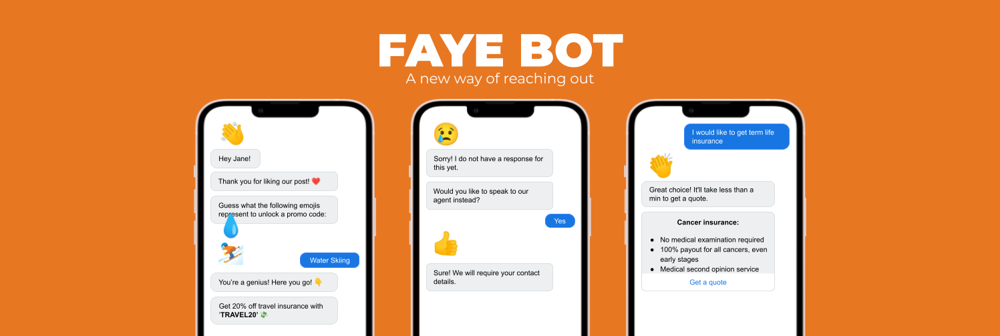
<h1 align="center">Capstone Chatbot</h1>
### Introduction

A chatbot hosted on Facebook that approaches customers with interactive features that encourages engagement between the brand and customers through providing assistance to customers’ queries and promoting awareness of the benefits of insurance, thereby leaving a memorable brand image on customers.

This is the README.md file for our [Rasa Action Server](https://rasa.com/docs/action-server/) component.

## Table of Contents

- [Table of Contents](#table-of-contents)
- [1. Tech Stack](#1-tech-stack)
- [2. Project Files Description](#2-project-files-description)
  - [Folder Structure](#folder-structure)
- [3. Installation & Configuration](#3-installation--configuration)
  - [Clone the repository](#clone-the-repository)
  - [Setting up the Virtual Environment (Windows User)](#setting-up-the-virtual-environment-windows-user)
  - [Setting up the Virtual Environment (Mac User)](#setting-up-the-virtual-environment-mac-user)
- [4. Rasa Action Server Usage](#4-rasa-action-server-usage)
- [5. Deployment on Heroku](#5-deployment-on-heroku)
  - [Create a Heroku app using Heroku CLI](#create-a-heroku-app-using-heroku-cli)
  - [Push changes to Heroku](#push-changes-to-heroku)
  - [Make requests to Rasa](#make-requests-to-rasa)
- [6. Deployment on Azure](#6-deployment-on-azure)
  - [Building the Docker image](#building-the-docker-image)
  - [Setting up Azure environment](#setting-up-azure-environment)
  - [Building the Docker image](#building-the-docker-image-1)
  - [Deployment via Azure ACR](#deployment-via-azure-acr)

## 1. Tech Stack

Here's a brief high-level overview of the tech stack:
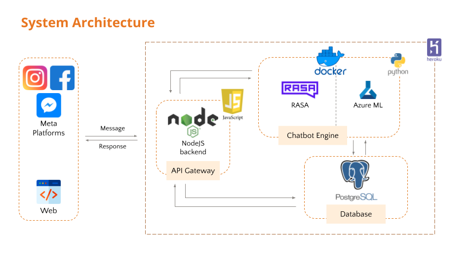

## 2. Project Files Description

### Folder Structure

    .
    ├── app
        ├── actions           Contains your custom actions which can be used to run custom Python code
        ├── data              This folder contains all NLU and RULES and STORIES files
        ├── models            Stored the trained Rasa NLU models
        ├── tests             Contains the test stories
        ├── config.yml        Configurations for the entire pipeline of the chatbot
        ├── domain            Contains all the intent and all the utters (responses) for each intent
        ├── endpoints.yml
        └── credentials.yml
    ├── requirements.txt      Stores all packages on which that project is dependent on to run
    ├── .gitignore            Specifies intentionally untracked files that Git should ignore
    ├── server.sh
    ├── Dockerfile            Commands used to assemble a Docker image
    ├── images                Images used in README.md
    └── README.md             Provides overview of the repository

## 3. Installation & Configuration

### Clone the repository

To clone the repository, install [git](https://git-scm.com/downloads) and run:

```
git clone x
```

Change directory into the repository:

```
cd rasa-salesbot-action
```

### Setting up the Virtual Environment (Windows User)

Install virtualenv:

```
pip install venv
```

Inside the project root folder, create a new virtual environment:

```
python -m venv ./venv
```

Activate virtualenv:

```
.\venv\Scripts\activate
```

Install the Python packages:

```
pip install -r requirements.txt
```

To deactivate the virtual environment:

```
deactivate
```

### Setting up the Virtual Environment (Mac User)

Inside the project root folder, create a new virtual environment:

```
virtualenv env
```

Activate virtualenv:

```
source env/bin/activate
```

Install the Python packages:

```
pip install -r requirements.txt
```

To deactivate the virtual environment:

```
deactivate
```

## 4. Rasa Action Server Usage

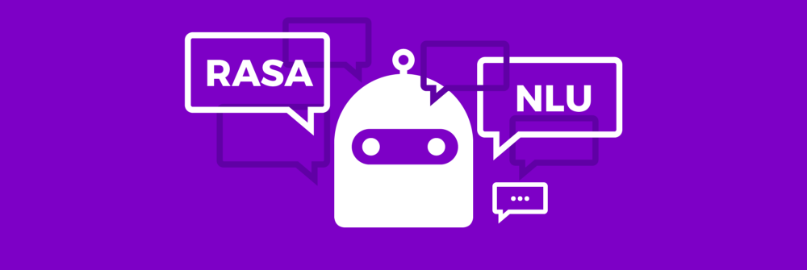

For more information:
https://rasa.com/docs/rasa/testing-your-assistant/

Change folder directory into Rasa:

```
cd app
```

Start the server with the trained model:

```
rasa run actions
```

## 5. Deployment on Heroku

### Create a Heroku app using Heroku CLI

Refer to the tutorial link below to create your Heroku app:
https://devcenter.heroku.com/articles/creating-apps#creating-a-named-app

### Push changes to Heroku

Install [Heroku CLI](https://devcenter.heroku.com/articles/heroku-cli#download-and-install).
Log in to Heroku using the Heroku CLI.

```
heroku login
```

> Please note that you need to be a collaborator in the heroku app.

You can now make changes to the RASA NLU by pushing the changes.

```
git add .
git commit -am "comments"
git push heroku master
```

Heroku will automatically handle the changes, re-build NLU model and re-start the server.

> Please note that locally trained NLU models won't be pushed to the Heroku repository.

### Make requests to Rasa

Once your server is deployed, you can make requests to your NLU model via [Rasa HTTP API](https://rasa.com/docs/rasa/api/http-api/#operation/parseModelMessage)
For example:

```
curl https://<your Heroku application name>.herokuapp.com/model/parse -d '{"text":"hello"}'
```

## 6. Deployment on Azure

### Building the Docker image

Install [Docker](https://docs.docker.com/engine/install/) and run:

```bash
docker build -t <imageID>
```

To run the Docker image locally:

```bash
docker run <imageID>
```

### Setting up Azure environment

Install [Azure CLI](https://docs.microsoft.com/en-us/cli/azure/install-azure-cli) and login to Azure:

```
az login
```

Setup the right subscription if required:

```
az account set --subscription <Subscription Name>
```

Create the resource group:

```
az group create --name rasaResourceGroup --location southeastasia
```

Create container registry:

```
az acr create --resource-group rasaResourceGroup --name rasaCR --sku Basic
```

> Make sure the container is unique, you can check [here](https://docs.microsoft.com/en-us/rest/api/containerregistry/registries/check-name-availability?tabs=HTTP#code-try-0)

Log in to the container registry:

```
az acr login --name rasaCR
```

### Building the Docker image

- In the Azure dashboard, click on the container registry created and get the login server as shown in the image
  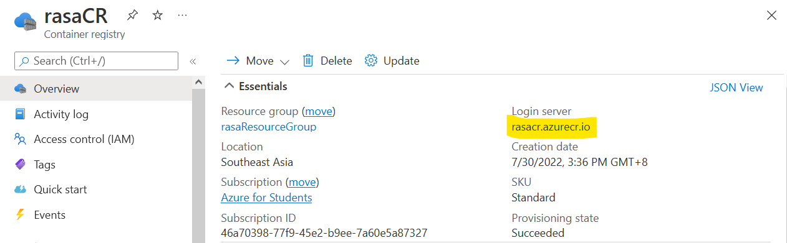
  Run the command:

```
docker tag <imageID> <Login server>/<imageID>
```

- Push the Docker image onto Azure

```
docker push <Login server>/<imageID>
```

### Deployment via Azure ACR
1. Click on Create a resource
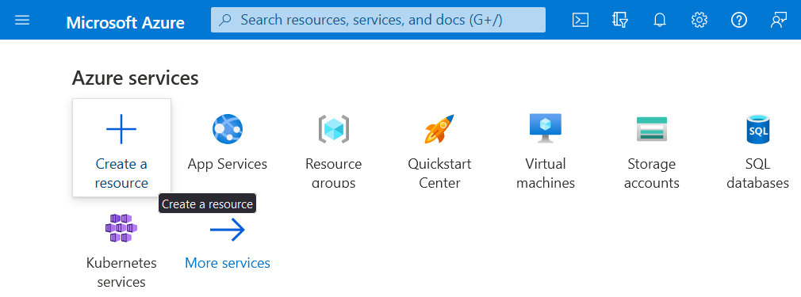
2. Type “web app for container” in the search bar and press enter, click Create
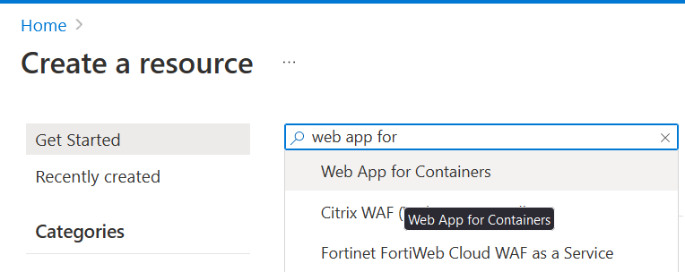
3. Under the Resource Group dropdown, pick the Resource Group you created earlier
Ensure the Sku and size section under App Service Plan is at least 14 GB of memory
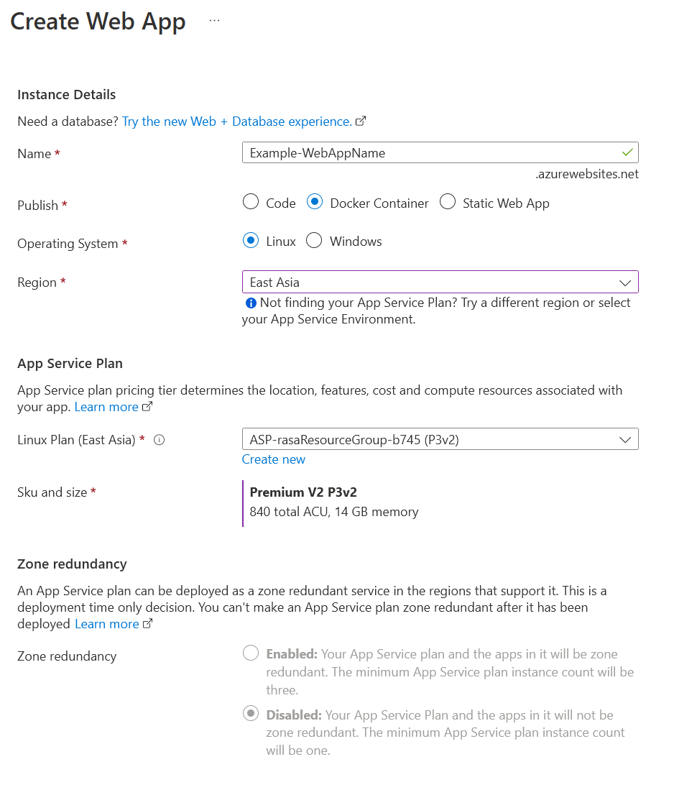
4. Click Docker in the top taskbar, under Image Source, select Azure Container Registry
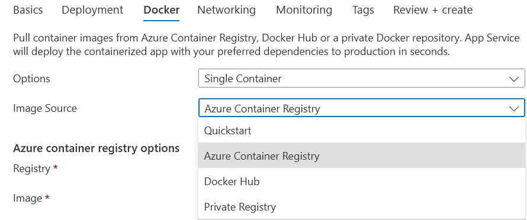
5. Choose the appropriate Registry, Image and Tag, based on what you created earlier, via dropdown
6. Click Review + create
7. After the app has been successfully created, access the app either from the notifications or the home page
8. Click Settings > Configuration > Application settings > New application setting
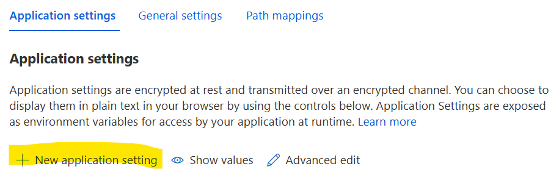
Fill up these 2 fields:
> NAME: WEBSITES_PORT
> VALUE: 8000
9. Click Save
10. Click Deployment > Deployment Center > Logs to view the deployment logs, the deployment should be a success, otherwise, try restarting the app in Overview
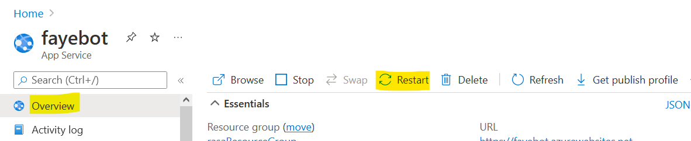
11. App endpoint URL can be found under Overview > Essentials
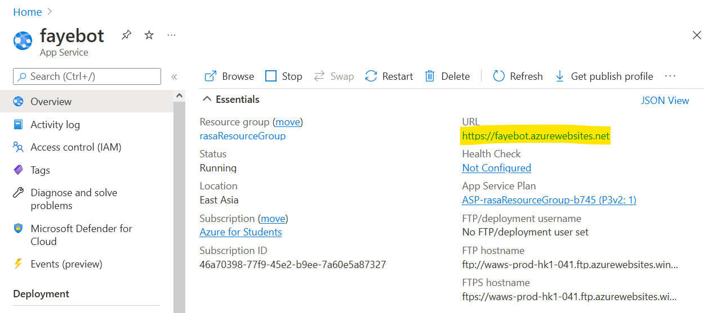